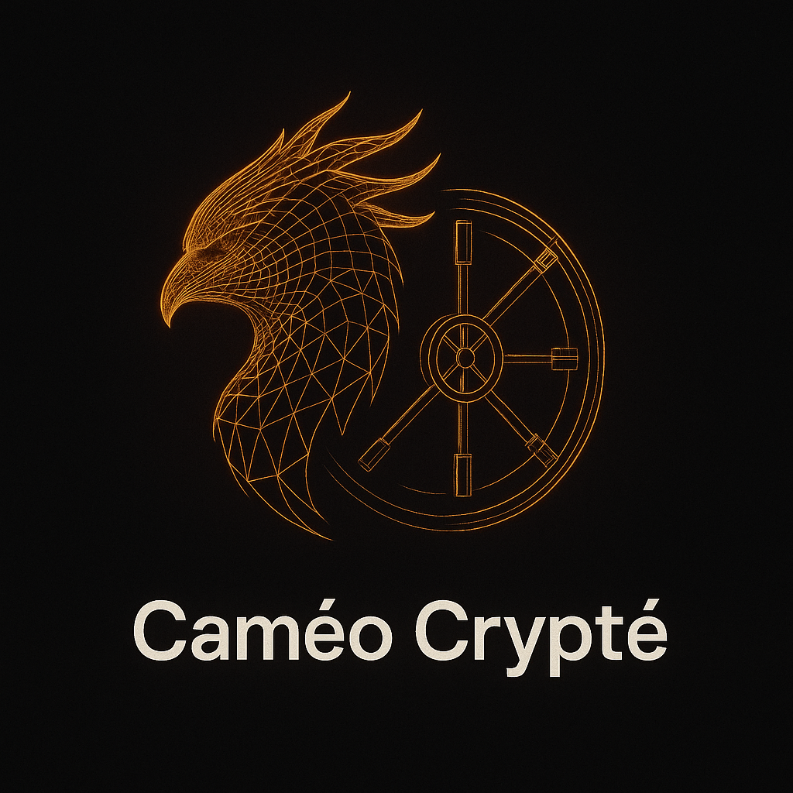

# Caméo Crypté Design System

This document outlines the visual language and reusable UI components of **Caméo Crypté**. It serves as a living style guide for designers and developers building features within the app and marketing site.

## Brand Essence

Caméo Crypté embraces a **luxurious cyber‑noir** aesthetic reminiscent of *Blade Runner 2049* fused with haute couture. The experience should feel dark, seductive and slightly dangerous. Copy is short, confident and almost arrogant—think: *“Your fortune dies with you. Unless you have a Caméo.”*

## Colour Palette

| Token          | Hex      | Usage                          |
|---------------:|:---------|:-------------------------------|
| `primary`      | `#000000`| Page backgrounds               |
| `secondary`    | `#0A0A0A`| Cards and panels               |
| `accent`       | `#FF4700`| Phoenix fire, buttons, glows   |
| `violet`       | `#8B00FF`| Biometric scans & hover states |
| `success`      | `#00FF9F`| Verification & success states  |
| `text-100`     | `#E4E4E4`| Primary text on dark backgrounds|
| `text-200`     | `#AAAAAA`| Secondary body copy            |
| `text-hero`    | `#FFFFFF`| Hero headlines                 |

Gradients blend the `accent` and `violet` colours: `linear-gradient(135deg, #FF4700, #8B00FF)`.

## Typography

| Style          | Font Stack                                         | Usage                          |
|---------------:|:---------------------------------------------------|:-------------------------------|
| Headings       | `Aeonik Pro`, `Neue Montreal Medium`, sans‑serif   | Hero titles, section headings  |
| Body           | `Satoshi`, `General Sans`, `Inter`, sans‑serif      | Paragraphs, labels             |
| Code/Terminal  | `JetBrains Mono`, `PP Mori`, monospace              | Code snippets & technical UI   |

> **Note:** Proprietary fonts (`Aeonik Pro`, `Neue Montreal`, `Satoshi`, `General Sans`, `PP Mori`) are replaced by high‑quality open alternatives (`Inter`, `JetBrains Mono`) in the development environment. Self‑host the licensed fonts in `/public/fonts` when available.

## Logos & Icons

The Caméo Crypté logo depicts a minimalist phoenix constructed from a **golden biometric wireframe** that morphs into a vault door. Use the full logo on marketing surfaces and a simplified mark for favicons and social avatars.

To generate a favicon, downscale the logo to 64×64 pixels and export as `favicon.ico`.

## Textures & Effects

- **Grain Overlay:** A subtle noise texture (`/public/textures/grain.png`) applied with low opacity breaks up flat colours and adds realism.
- **Particle Background:** Floating particles in orange and violet hues animate behind all pages, creating depth.
- **Glassmorphism:** Cards and panels use blurred, translucent backgrounds with faint borders to suggest frosted glass.
- **Glow & Shadows:** Buttons and active elements emit orange glows with violet highlights, achieved via custom box‑shadows.

## Components

### PhoenixLogo3D

A declarative 3D approximation of the phoenix is built with **React Three Fiber**. A torus knot rendered in wireframe rotates slowly; on hover it shifts colour from orange to violet, hinting at its morph into a vault.

### ParticleBackground

A full‑screen Three.js scene containing hundreds of small points. Each particle randomly interpolates between the accent and violet colours. The system moves subtly to give a sense of life without distraction.

### GlassCard

A versatile container component implementing glassmorphism. It includes border, blur and shadow. Cards lift slightly and glow on hover.

### GlowingButton

A reusable button with gradient fills (accent→violet) and responsive micro‑interactions. It scales on hover and tap using Framer Motion.

### LivenessPlaceholder

Until the FaceTec SDK is fully integrated, this component visualises a liveness check. It displays a wireframe sphere with a scanning line sweeping across its surface.

### SuccessPhoenix

Used after successful enrollment or recovery. It combines the Phoenix logo with extra particles to celebrate the event.

## Layout

Both the marketing site and the PWA share a base layout:

1. **Background layers** – The `ParticleBackground` sits behind everything. A grain overlay on top adds texture.
2. **Content** – Sections are centred with generous padding. Typography is large and spaced out.
3. **Footer** – Contains legal copy and social links styled in secondary text colour.

## Motion & Interaction

- **Smooth Scrolling:** Implemented via the `lenis` library, providing consistent scroll behaviour across devices.
- **Scroll‑linked Animations:** Use Framer Motion’s `useScroll` hooks to tie element animations to scroll position. GSAP may be used for advanced sequences (e.g. aging morph transitions).
- **Micro‑interactions:** Buttons glow, cards lift and the Phoenix reacts to pointer movement.
- **Success Animations:** Phoenix bursts of fire and particle showers celebrate key milestones.

## Accessibility

Colour contrasts meet WCAG guidelines for dark interfaces. Motion effects respect users’ reduced motion preferences. All interactive elements are focusable and provide visual focus indicators.

---

For any contributions or new components, adhere to the palette, typography and interaction guidelines defined above. Keep the cyber‑noir luxury tone consistent throughout the experience.